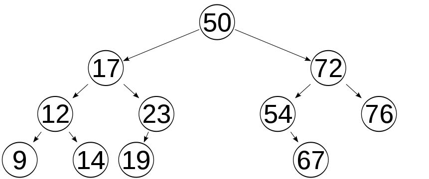
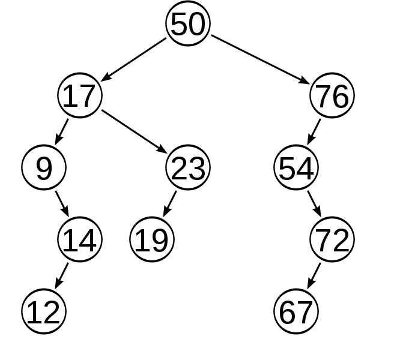

# Arvore Binaria
**Arvore binaria** é um método de busca baseado em nós onde existe um nó pai e vai se ramificando em 2 em 2, os nós filhos podem ter mais dois filhos e assim por diante.

#### Existem dois tipos de arvore binaria:
1. Arvore binaria balanceada
    - Na *arvore binaria balanceada* o tamanho da arvore é fixo, podendo inserir novos elementos e manter o mesmo tamanho, assim melhorando a busca.

2. Arvore binario não balanceada
    - Na *arvore binaria não balanceada* o tamanho é definido pelo tanto de inserções que é colocado. 

#### Exemplo arvore balanceada

#### Exemplo arvore não balanceada
