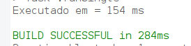
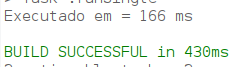
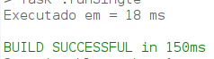
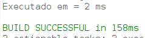

# Ordenação de dados
Na computação existe uma série de algoritmos que utilizam diferentes técnicas de ordenação para organizar um conjunto de dados, eles são conhecidos como Métodos de Ordenação ou Algoritmos de Ordenação.

#### Principais métodos de ordenação:
- Bubble sort
- Selection sort
- Insertion sort
- Quick sort

## Bubble sort
O **bubble sort**, ou *ordenação por flutuação*, é um algoritmo de ordenação dos mais simples. A ideia é percorrer o vector diversas vezes, e a cada passagem fazer flutuar para o topo o maior elemento da sequência.

#### Exemplo

~~~java 
public class BubbleSort {
    public static void main(String[] args) {

        int quantidade = 10000;
        int[] vetor = new int[quantidade];

        for (int i = 0; i < vetor.length; i++) {
            vetor[i] = (int) (Math.random() * quantidade);
        }

        long tempoInicial = System.currentTimeMillis();

        bubbleSort(vetor);

        long tempoFinal = System.currentTimeMillis();

        System.out.println("Executado em = " + (tempoFinal - tempoInicial) + " ms");

    }

    private static void bubbleSort(int vetor[]) {
        boolean troca = true;
        int aux;
        while (troca) {
            troca = false;
            for (int i = 0; i < vetor.length - 1; i++) {
                if (vetor[i] > vetor[i + 1]) {
                    aux = vetor[i];
                    vetor[i] = vetor[i + 1];
                    vetor[i + 1] = aux;
                    troca = true;
                }
            }
        }
    }

}

~~~

#### Tempo de execução:

## Selection sort
A **ordenação por seleção** é um algoritmo de ordenação baseado em se passar sempre o menor valor do vetor para a primeira posição, depois o de segundo menor valor para a segunda posição, e assim é feito sucessivamente com os n-1 elementos restantes.

#### Exemplo:
~~~java

public class SelectionSort {
    public static void main(String[] args) {

   int quantidade = 10000;
   int[] vetor = new int[quantidade];
   for (int i = 0; i < vetor.length; i++) {
      vetor[i] = (int) (Math.random()*quantidade);
   }

   long tempoInicial = System.currentTimeMillis();

   selectionSort(vetor);

   long tempoFinal = System.currentTimeMillis();

   System.out.println("Executado em = " + (tempoFinal - tempoInicial) + " ms");

 }

 public static void selectionSort(int[] array) {
  for (int fixo = 0; fixo < array.length - 1; fixo++) {
    int menor = fixo;

    for (int i = menor + 1; i < array.length; i++) {
       if (array[i] < array[menor]) {
          menor = i;
       }
    }
    if (menor != fixo) {
      int t = array[fixo];
      array[fixo] = array[menor];
      array[menor] = t;
    }
  }
}
}
~~~

#### Tempo de execução:

## Insertion sort
**Insertion Sort** é um algoritmo de ordenação que, dado uma estrutura constrói uma matriz final com um elemento de cada vez.

#### Exemplo:
~~~java
public class InsertionSort {

    public static void main(String[] args) {

        int quantidade = 10000;
        int[] vetor = new int[quantidade];

        for (int i = 0; i < vetor.length; i++) {
            vetor[i] = (int) (Math.random() * quantidade);
        }

        long tempoInicial = System.currentTimeMillis();

        insertionSort(vetor);

        long tempoFinal = System.currentTimeMillis();

        System.out.println("Executado em = " + (tempoFinal - tempoInicial) + " ms");

    }

    public static void insertionSort(int[] vetor) {
        int j;
        int key;
        int i;

        for (j = 1; j < vetor.length; j++) {
            key = vetor[j];
            for (i = j - 1; (i >= 0) && (vetor[i] > key); i--) {
                vetor[i + 1] = vetor[i];
            }
            vetor[i + 1] = key;
        }
    }
}
~~~

#### Tempo de execução:

## Quick sort
O algoritmo **quicksort** é um método de ordenação muito rápido e eficiente, inventado por C.A.R. Hoare em 1960, quando visitou a Universidade de Moscovo como estudante. O quicksort adota a estratégia de divisão e conquista. A estratégia consiste em rearranjar as chaves de modo que as chaves &quot;menores&quot; precedem as chaves &quot;maiores&quot;.

~~~java
public class QuickSort {
    public static void main(String[] args){

             int quantidade = 10000;
             int[] vetor = new int[quantidade];

             for (int i = 0; i < vetor.length; i++) {
                     vetor[i] = (int) (Math.random()*quantidade);
             }

             long tempoInicial = System.currentTimeMillis();

             quickSort(vetor,0,vetor.length-1);

             long tempoFinal = System.currentTimeMillis();

             System.out.println("Executado em = " + (tempoFinal - tempoInicial) + " ms");

       }

       private static void quickSort(int[] vetor, int inicio, int fim) {
             if (inicio < fim) {
                    int posicaoPivo = separar(vetor, inicio, fim);
                    quickSort(vetor, inicio, posicaoPivo - 1);
                    quickSort(vetor, posicaoPivo + 1, fim);
             }
       }

       private static int separar(int[] vetor, int inicio, int fim) {
             int pivo = vetor[inicio];
             int i = inicio + 1, f = fim;
             while (i <= f) {
                    if (vetor[i] <= pivo)
                           i++;
                    else if (pivo < vetor[f])
                           f--;
                    else {
                           int troca = vetor[i];
                           vetor[i] = vetor[f];
                           vetor[f] = troca;
                           i++;
                           f--;
                    }
             }
             vetor[inicio] = vetor[f];
             vetor[f] = pivo;
             return f;
       }
}
~~~

#### Tempo de execução:

## Conclusão
O algoritmo com maior eficiencia é o **QuickSort**, podemos perceber que ele ganha somente analisando o tempo de execução de cada algoritmo sendo que ambos continham a mesma quantidade de itens para comparação. O **QuickSort** utiliza o esquema de divisão e conquista onde separa o problema em varios pedaços mais pequenos e resolvendo eles separadamente para aumentar a velocidade da busca.

### Link para acessar pesquisa sobre arvores binarias:
[Arvores Binarias](arvoreBinaria.md)